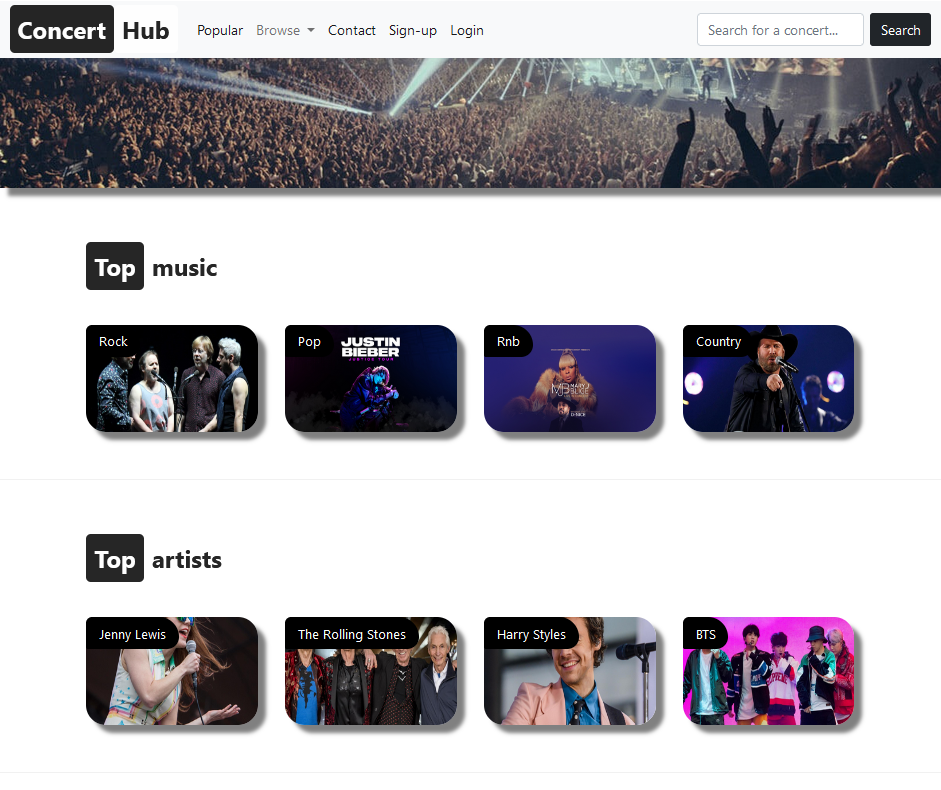
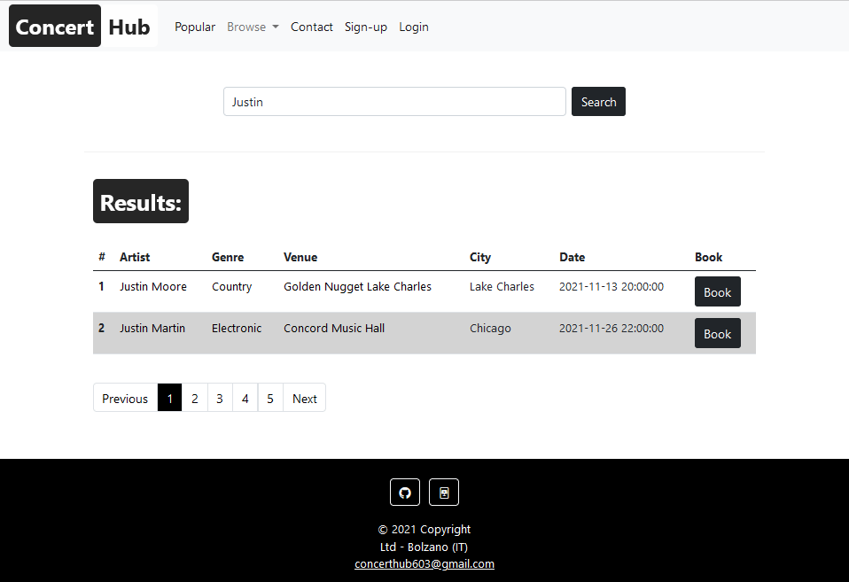
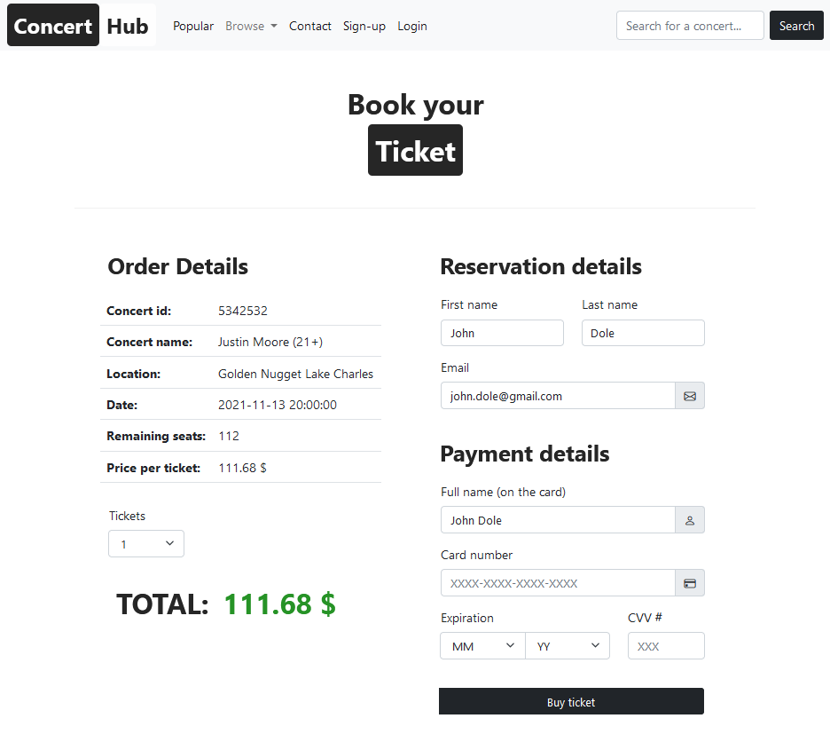
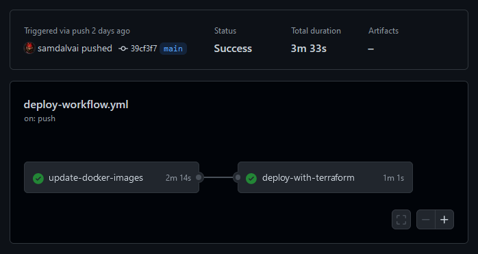
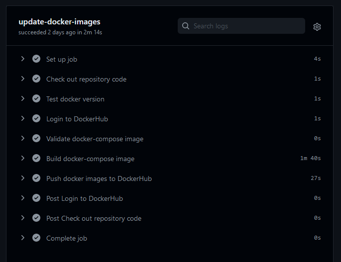
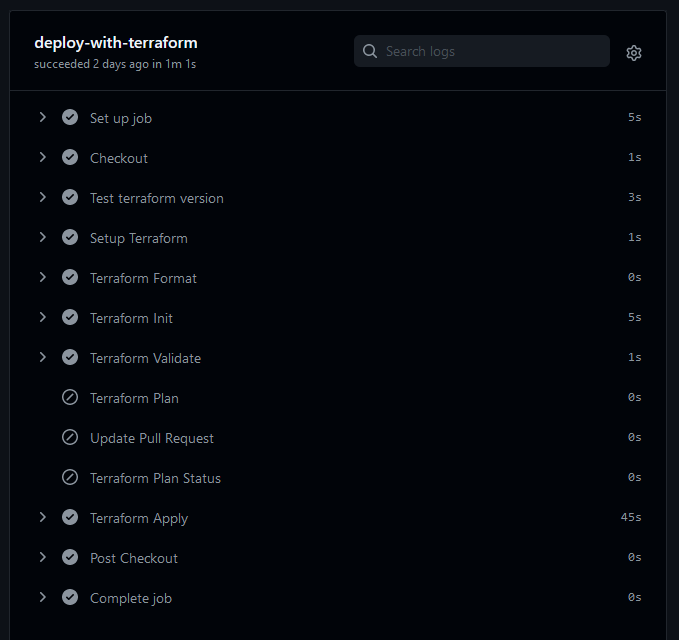
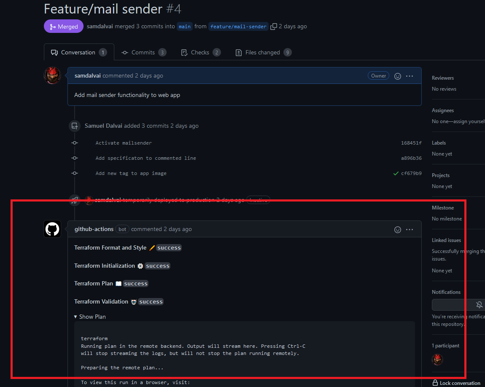
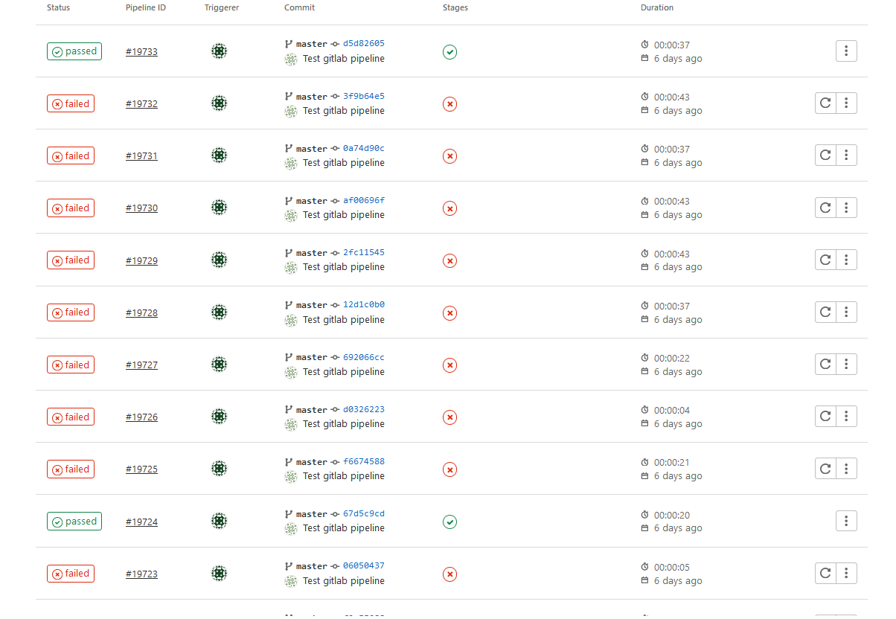

# Project for the System Engineering course 2021/22

* [Application description](#application-description)
* [How the application is deployed](#how-the-application-is-deployed)
* [Description of the pipeline for CI/CD](#description-of-the-pipeline-for-CI/CD)
    * [Pipeline stages](#pipeline-stages)
    * [Update of the docker images](#update-of-the-docker-images)
    * [Deployment with terraform](#deployment-with-terraform)
    * [Experience with GitLab CI/CD](#instructions-for-manual-deployment)
* [Instructions for manual deployment](#instructions-for-manual-deployment)
* [Author](#author)
* [Notes](#notes)

 

# Application description

The name of the application is ConcertHub, it is a web application for the booking of concert events in the US. The application consists on three main components: a PHP web application, a MySql database and a Python script which populates the database on a regular basis with data extracted from the [SeatGeek API](https://platform.seatgeek.com/). The website consists in a home page where the user can found the top categories, artists and locations for concerts.

The criteria for being in the "Top" section follows a score system provided by the API. The user can also perform a search for a concert based on some keywords.

Finally, when the user has found a concert, he can book a ticket.

The user will then be able to print the confirmation and will also receive a confirmation email for the booking. Further functionalities are supported by the web application, for example it is possible to sign in with a personal account and also to browse the concert by category and location.

 

# How the application is deployed

The web application is deployed as a Docker multi-container app on [Microsoft Azure](https://azure.microsoft.com/en-us/). There are a total of three containers:

* **concerthub_app** container: a `php:7.2-apache` docker image which serves as the web server for the php application. The docker image has been personalized by adding additional components, like the `mysqli` libraries and `composer`, which is used to add a mailing functionality to the we application.
* **concerthub_mysql** container: a `mysql:5.7` docker image with an sql schema that is loaded on startup. The loaded schema will add a concert database with tables for concerts, categories, perfomers and all the tables needed from the web application.
* **concerthub_python** container: a `python:3` docker image with additional components such as `mysqlclient` and `mysql-connector-python` for the connection to the `mysql` container. On startup this container will load a python script that will run a scheduled job every 10 minutes. The only job that is run consists in queryng the [SeatGeek API](https://platform.seatgeek.com/) and loading the data on the `mysql` database.

As stated above, the application is deployed on [Microsoft Azure](https://azure.microsoft.com/en-us/). The infrastructure on top of which the application is running consists in the following components:

* A **Resource Group** with location "North Europe".
* An **App Service Plan** with location "North Europe" running on a Linux OS and `Basic` pricing tier `B1` for reduced cost. Running the application on the `Free` tier allows the testing of the application without any charge, but the application will not be stable and will be restarted often.
* A **Web App Service** running on Docker Container of type Compose that retrieves the latest docker images from DockerHub.

By following the "Infrastructure as Code" philosophy, the whole creation and destruction of the infrastructure is managed by using of [Terraform](https://www.terraform.io/). In order to make the process of building the infrastructure more easy, and also later on to allow an automatic pipeline to manage this process, the Terraform state is not stored locally, but rather on a remote Terraform repository. See [store remote state with terraform](https://www.terraform.io/) for more information.

# Description of the pipeline for CI/CD

This project makes use of GitHub Actions in order to run an automatic pipeline for the deployment of the web application to the [Microsoft Azure](https://azure.microsoft.com/en-us/) cloud service provider. If you wish to deploy the application manually you can follow the [instructions for manual deployment](#instructions-for-manual-deployment).

## Pipeline stages

The pipeline for the continuous integration and development of this application consists in two main stages, namely the update of the docker images and the deployment with terraform. The second stage cannot begin until the first one has terminated successfully.

## Update of the docker images

In this stage the docker images are built and pushed to a repository on [DockerHub](https://hub.docker.com/). This stage consists in 6 different jobs that are performed one after the other.

The first job checks the repository code out in order to make it available to the runner, after that the runner tests the current docker and docker-compose version. Subsequently the runner logs into DockerHub with a `DOCKERHUB_USERNAME` and `DOCKERHUB_PASSWORD` which are the private access credential for the DockerHub repository and are stored as a secret in GitHub, see [GitHub secrets](https://github.com/Azure/actions-workflow-samples/blob/master/assets/create-secrets-for-GitHub-workflows.md) for further details. At this point the docker-compose image is built and then pushed to the DockerHub repository.

## Deployment with terraform

At this stage the docker images will already be pushed to the DuckerHub registries, thus we can proceed with applying the changes to `Microsoft Azure` by using `Terraform`. This stage consists of 10 jobs, two of which are applied only in case of a GitHub pull request, when a branch is merged with the main one.

As the previous stage, the first job checks the repository code out, after that the Terraform version is tested and the runner logs into Terraform by using a `TF_API_TOKEN`, which is provided by Terraform and stored on GitHub as a secret variable, see [Terraform GitHub actions](https://learn.hashicorp.com/tutorials/terraform/github-actions) for further details. The pipeline continues by initializing the backend and downloading the required plugins based on the `main.tf` file, after that the configuration is validated. At this point, if the event that triggered the pipeline was a simple commit, the changes will be applied directly. On the other hand, if the event was a pull request, a new plan will be created and displayed in the information of the pull request, after that the plan will be applied.

After some minutes the application will be available at (https://concerthubapp.azurewebsites.net/)

## Experience with GitLab CI/CD

GitHub actions have been chosen over GitLab CI/CD feature because they are more simple to manage while offering similar functionalities. The original plan for building the CI/CD pipeline for this project was to use GitLab CI/CD functionality, but after encountering some major problems with the configuration of the docker-compose stage I decided to migrate the project on HitGub.

The main problem with GitLab is that in some cases it requires to configure a local runner for the jobs of the pipeline. For example when configuring a job for building the docker images we need to have a docker image running on top of the docker image of the runner (a docker in docker). In order to use the docker daemon inside another docker some particular configuration has to be done to register a new runner which must run on the local machine in order to be used. For this reason, and for the simplicity on the configuration I have chosen GitHub over GitLab for the CI/CD pipeline.

 

# Instructions for manual deployment

You can use the following instructions in the case in which you do not want to make use of the pipeline for the continuous integration/deployment of the application,
## Creation of the Docker images for local development

* This application is deployed using three Docker containers, one for the php web application, one for the mysql database and one for the python scheduled jobs.
* In order to tun the application locally you need Docker installed on your machine.
* Run the Docker application.
* From inside the `root/` folder of the project run the following command to create the docker images and run them: `docker-compose up -d` (you can omit -d if you do not want to run it in detached mode)
* Open a web browser and access [localhost, port 8080](http://localhost:8080) to run the application.
* In order to stop execution of the docker containers, run the command `docker-compose down`

## Bulding and pushing the docker images to DockerHub

* For the next step you need to push the three Docker images to Dockerhub, to do so you need first to change the image name `samdalvai/`  in the `docker-compose` file to your DockerHub username. Alternatively you can use the three latest images in the `samdalvai` DockerHub repository.
* Run the command `docker-compose build` to build the images
* Run the command `docker-compose` push to push the three images to your DockerHub repository.
* You can skip the last three instructions if you decide to use the latest versions of the `samdalvai/` images.

## Deploying the application on remote

This application is deployed using [Microsoft Azure](https://azure.microsoft.com/en-us/) cloud service provider. There are three ways to deploy the application in remote, either from the [Microsoft Azure](https://azure.microsoft.com/en-us/) website, or with the command line by either using `az cli` or `Terraform`
### Deployment on Microsoft Azure with az cli
* First of all you need a Microsoft Azure Account
* Next you need to download the latest `azure-cli` command line tool
* Log in to your Azure account by using the command `az login`, you will be redirected to the web browser where you will need to provide your Azure credential
* Now you can create all the infrastructure for the app.
* Run `az group create --name myResourceGroup --location "North Europe"` to create the resource group.
* Run `az appservice plan create --name myAppServicePlan --resource-group myResourceGroup --sku S1 --is-linux` to create an App service plan in the Standard pricing tier.
* At this step if you pushed your own docker images to `DockerHub` you need to set the image name in the `azure-docker-compose.yml` file. Run `az webapp create --resource-group myResourceGroup --plan myAppServicePlan --name <app-name> --multicontainer-config-type compose --multicontainer-config-file azure-docker-compose.yml` from the `root/` folder of the project to create the App with a name of your choice.
* Access the app in your browser at: `http://<app-name>.azurewebsites.net`.
* Access the logs of your app at: `https://<app-name>.scm.azurewebsites.net/api/logs/docker`.
* Run `az group delete --name myResourceGroup` to delete the resource group along with the service plan and the app.

### Deployment on Microsoft Azure with Terraform

* First of all you need to install the [Terraform client](https://learn.hashicorp.com/tutorials/terraform/install-cli?in=terraform/azure-get-started) on your machine.
* For the next step you need to have completed the first 3 steps of the instructions described in the previous paragraph: [Deployment with az cli](#deployment-on-microsoft-azure-with-az-cli)
* You can set the name of the resource group, the location, the app service plan and the app service in the `variables.tf` file.
* From the `root/` folder of the project run `terraform initi` to initialize the provider plugins.
* Run `terraform validate` to validate the `main.tf` file.
* Run `terraform apply` to build the infrastructure, type `yes` when requested to do so.
* After some minutes the infrastructure on Azure will be online and you will be able to access the application as decribed in the last steps of the previous paragraph:  [Deployment with az cli](#deployment-on-microsoft-azure-with-az-cli)
* Run `terraform destroy` and type `yes` when required to destroy all the infrastructure.

 

# Author
**Name**: Samuel Dalvai  
**Student Id**: 17682  
**Email**: samdalvai@unibz.it  

 

# Notes

The web application used in the scope of this project has been developed as a final project for the course `Web and Internet Engineering` in the academic year 2020/21, see the original version of this project at the GitLab [project page](https://gitlab.inf.unibz.it/Tedi.Ibershimi/web-engineering-csmontali6).